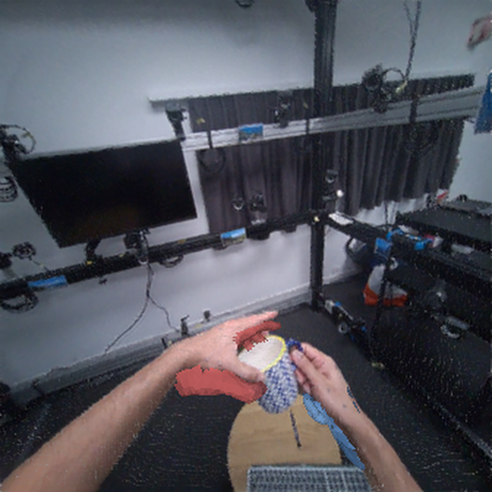

# HOT3D sample — the egocentric data we use

A representative sample of the data this project actually trains and evaluates the
hand head on: **[HOT3D](https://www.projectaria.com/datasets/hot3d/)** (Meta
Project Aria, egocentric RGB). The image is a HOT3D Aria first-person view of two
hands manipulating an object, with **our reconstructed MANO hand meshes overlaid**
(left hand red, right hand blue) — i.e. the input modality plus what our
hand-recovery head produces from it.

## Why a render and not raw frames?

HOT3D is released under a license that requires accepting an agreement to download
and **restricts redistribution**, so we do not commit raw HOT3D frames to this
public repository. The image above is our own derived visualization.

To obtain the real data, download HOT3D from the official source (and accept its
license):

- Dataset: <https://www.projectaria.com/datasets/hot3d/>
- Tooling: <https://github.com/facebookresearch/hot3d>

We preprocess each sequence to undistorted pinhole frames (focal 609) with hand
and camera ground truth; the model consumes 16-frame clips at 224×224.

> A short **real** preprocessed clip from one HOT3D sequence is included separately
> in the course submission package — it is not committed here for the license
> reason above.
